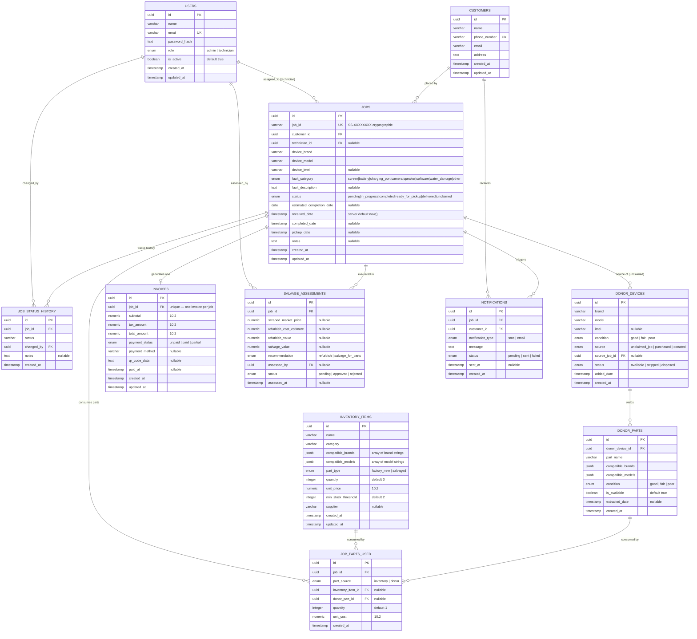
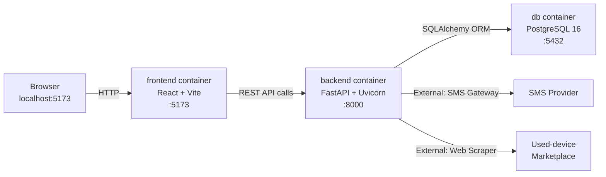
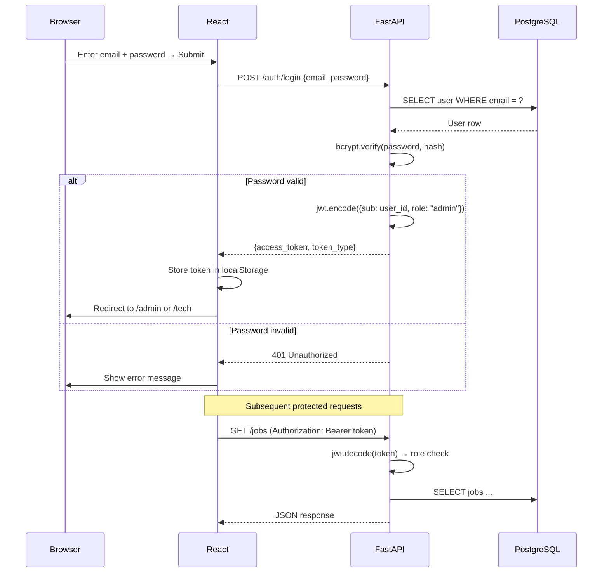

# ServiceSync — Architecture Reference

> Open this file in VS Code and press `Ctrl+Shift+V` (or click the preview icon top-right) to render all diagrams.
> Install the **"Markdown Preview Mermaid Support"** extension if diagrams don't render automatically.

---

## 1. Database Schema (ERD)

11 tables auto-created by SQLAlchemy on startup (`Base.metadata.create_all`).
All primary keys are UUID. Foreign keys are enforced at the database level.

---

## 2. Backend Class Architecture

Legend: `<<model>>` = SQLAlchemy ORM · `<<service>>` = business logic · `<<router>>` = FastAPI endpoints
Solid arrow = uses/depends on · dashed arrow = Sprint 3/4 (not yet built)

```mermaid
classDiagram

    %% ── ORM Models ──────────────────────────────────────────────────

    class User {
        <<model>>
        +id : UUID
        +name : str
        +email : str
        +password_hash : str
        +role : enum  "admin | technician"
        +is_active : bool
        +created_at : datetime
    }

    class Customer {
        <<model>>
        +id : UUID
        +name : str
        +phone_number : str
        +email : str
        +address : str
        +created_at : datetime
    }

    class Job {
        <<model>>
        +id : UUID
        +job_id : str        "SS-XXXXXXXX"
        +customer_id : UUID
        +technician_id : UUID
        +device_brand : str
        +device_model : str
        +device_imei : str
        +fault_category : enum
        +fault_description : str
        +status : enum
        +estimated_completion_date : date
        +received_date : datetime
        +completed_date : datetime
        +notes : str
    }

    class JobStatusHistory {
        <<model>>
        +id : UUID
        +job_id : UUID
        +status : str
        +changed_by : UUID
        +notes : str
        +created_at : datetime
    }

    class InventoryItem {
        <<model>>
        +id : UUID
        +name : str
        +category : str
        +compatible_brands : jsonb
        +compatible_models : jsonb
        +part_type : enum  "factory_new | salvaged"
        +quantity : int
        +unit_price : Decimal
        +min_stock_threshold : int
        +supplier : str
    }

    class DonorDevice {
        <<model>>
        +id : UUID
        +brand : str
        +model : str
        +imei : str
        +condition : enum  "good | fair | poor"
        +source : enum
        +source_job_id : UUID
        +status : enum  "available | stripped | disposed"
    }

    class DonorPart {
        <<model>>
        +id : UUID
        +donor_device_id : UUID
        +part_name : str
        +compatible_brands : jsonb
        +compatible_models : jsonb
        +condition : enum
        +is_available : bool
        +extracted_date : datetime
    }

    %% ── Services (Sprint 1 & 2 — BUILT) ────────────────────────────

    class AuthService {
        <<service>>
        +login(request, db) dict
        +create_user(data, db) User
    }

    class SecurityHelpers {
        <<service>>
        +hash_password(plain) str
        +verify_password(plain, hashed) bool
        +create_access_token(data) str
        +decode_token(token) dict
    }

    class DepsHelpers {
        <<service>>
        +get_current_user(credentials, db) User
        +require_admin(current_user) User
        +require_technician(current_user) User
        +require_any_staff(current_user) User
    }

    class CustomerService {
        <<service>>
        +create_customer(data, db) Customer
        +list_customers(db, search) list
        +get_customer(id, db) Customer
        +update_customer(id, data, db) Customer
    }

    class JobService {
        <<service>>
        +create_job(data, created_by, db) dict
        +list_jobs(db, status, technician_id) list
        +get_job(job_id, db) dict
        +get_job_by_public_id(public_id, db) dict
        +update_status(job_id, data, changed_by, db) dict
        +assign_technician(job_id, data, db) dict
        -_generate_job_id(db) str
    }

    class InventoryService {
        <<service>>
        +create_item(data, db) dict
        +list_items(db, search, low_stock_only) list
        +get_item(item_id, db) dict
        +adjust_stock(item_id, data, db) dict
        +suggest_compatible_parts(brand, model, db) dict
    }

    class DonorService {
        <<service>>
        +register_donor_device(data, db) DonorDevice
        +list_donor_devices(db) list
        +get_donor_device(device_id, db) DonorDevice
        +add_donor_part(data, db) DonorPart
        +list_parts_for_device(device_id, db) list
    }

    %% ── Services (Sprint 3 — NOT YET BUILT) ────────────────────────

    class InvoiceService {
        <<service>>
        +generate_invoice(job_id, db) Invoice
        +calculate_total(job_id, db) Decimal
        +generate_qr_code(invoice) str
        +mark_paid(invoice_id, method, db) Invoice
    }

    class NotificationService {
        <<service>>
        +notify_status_change(job, db) void
        +send_sms(phone, message) bool
        +log_notification(job_id, customer_id, db) Notification
    }

    class SalvageService {
        <<service>>
        +assess_device(job_id, db) SalvageAssessment
        +scrape_market_price(brand, model) Decimal
        +calculate_salvage_value(parts) Decimal
        +make_recommendation(assessment) str
    }

    %% ── Model relationships ─────────────────────────────────────────

    Job          "many" --> "1"    Customer         : placed by
    Job          "many" --> "0..1" User             : assigned to
    JobStatusHistory "many" --> "1" Job             : tracks
    JobStatusHistory "many" --> "1" User            : changed by
    DonorDevice  "many" --> "0..1" Job              : sourced from
    DonorPart    "many" --> "1"    DonorDevice      : extracted from

    %% ── Service → Model dependencies (built) ───────────────────────

    AuthService      --> User
    CustomerService  --> Customer
    JobService       --> Job
    JobService       --> JobStatusHistory
    JobService       --> Customer
    JobService       --> User
    InventoryService --> InventoryItem
    InventoryService --> DonorPart
    DonorService     --> DonorDevice
    DonorService     --> DonorPart
    DepsHelpers      --> User
    SecurityHelpers  <-- AuthService

    %% ── Sprint 3 service dependencies (dashed = not built yet) ─────

    InvoiceService      ..> Job
    InvoiceService      ..> InventoryItem
    NotificationService ..> Job
    NotificationService ..> Customer
    SalvageService      ..> Job
    SalvageService      ..> DonorPart
```

---

## 3. React Frontend Component Tree

Route layout showing public vs protected paths and component hierarchy.

```mermaid
graph TD
    App["App.jsx\nBrowserRouter + AuthContext"]

    App --> PublicRoutes["Public Routes\n(No login required)"]
    App --> ProtectedRoutes["Protected Routes\n(JWT required)"]

    PublicRoutes --> LoginPage["LoginPage\n/login"]
    PublicRoutes --> TrackingPage["TrackingPage\n/track/:jobId"]

    TrackingPage --> ProgressBar["ProgressBar\nComponent"]
    TrackingPage --> StatusTimeline["StatusTimeline\nComponent"]
    TrackingPage --> DeviceInfo["DeviceInfo\nComponent"]

    ProtectedRoutes --> AdminLayout["AdminLayout\nrole: admin"]
    ProtectedRoutes --> TechnicianLayout["TechnicianLayout\nrole: technician"]

    AdminLayout --> AdminDashboard["AdminDashboard\n/admin"]
    AdminLayout --> JobManagement["JobManagement\n/admin/jobs"]
    AdminLayout --> CustomerRegistry["CustomerRegistry\n/admin/customers"]
    AdminLayout --> InventoryManager["InventoryManager\n/admin/inventory"]
    AdminLayout --> TechnicianPanel["TechnicianPanel\n/admin/technicians"]
    AdminLayout --> SalvageConsole["SalvageConsole\n/admin/salvage"]
    AdminLayout --> AnalyticsDashboard["AnalyticsDashboard\n/admin/analytics"]
    AdminLayout --> InvoiceManager["InvoiceManager\n/admin/invoices"]

    TechnicianLayout --> TechDashboard["TechDashboard\n/tech"]
    TechnicianLayout --> JobQueue["JobQueue\n/tech/jobs"]
    TechnicianLayout --> JobDetail["JobDetail\n/tech/jobs/:id"]

    AdminDashboard --> StatsCard["StatsCard"]
    AdminDashboard --> RecentJobsTable["RecentJobsTable"]
    AdminDashboard --> LowStockAlert["LowStockAlert"]
    AdminDashboard --> RevenueChart["RevenueChart"]

    JobManagement --> JobForm["JobForm\n(create/edit)"]
    JobManagement --> JobTable["JobTable"]
    JobManagement --> JobFilter["JobFilter"]

    InventoryManager --> InventoryTable["InventoryTable"]
    InventoryManager --> AddPartForm["AddPartForm"]
    InventoryManager --> StockAlertBadge["StockAlertBadge"]

    JobDetail --> StatusUpdater["StatusUpdater"]
    JobDetail --> RepairNotes["RepairNotes"]
    JobDetail --> CompatiblePartsPanel["CompatiblePartsPanel\nSmart Reuse"]
```

---

## 4. Docker Services Architecture

---

## 5. Authentication Flow

---

## 6. Use Case Diagram

Actors: **Admin** (shop manager), **Technician** (repair staff), **Customer** (public, no login).
All use cases inside the system boundary. Dashed border groups = functional modules.

```mermaid
graph LR

    %% ── Actors ────────────────────────────────────────────────────────────────
    Admin(["&lt;&lt;Actor&gt;&gt;\nAdmin"])
    Tech(["&lt;&lt;Actor&gt;&gt;\nTechnician"])
    Cust(["&lt;&lt;Actor&gt;&gt;\nCustomer"])

    %% ── System Boundary ───────────────────────────────────────────────────────
    subgraph SYS["ServiceSync — System Boundary"]

        subgraph AUTH["Authentication"]
            UC_login("Login to System")
        end

        subgraph JOB["Job Management"]
            UC_regJob("Register New Job")
            UC_listJobs("View All Jobs")
            UC_assignTech("Assign Technician to Job")
            UC_updateStatus("Update Job Status")
            UC_viewDetail("View Job Detail")
            UC_recordParts("Record Parts Used")
            UC_viewHistory("View Status History")
        end

        subgraph CUSTMOD["Customer Registry"]
            UC_addCust("Add Customer")
            UC_searchCust("Search Customers")
        end

        subgraph INV["Inventory Management"]
            UC_addPart("Add Inventory Part")
            UC_adjustStock("Adjust Stock Level")
            UC_lowStock("View Low-Stock Alerts")
            UC_smartParts("Smart Parts Suggestion")
        end

        subgraph DONOR["Donor Device Management"]
            UC_regDonor("Register Donor Device")
            UC_addDonorPart("Add Extracted Parts")
        end

        subgraph STAFF["Staff Management"]
            UC_addTech("Create Technician Account")
            UC_viewTechs("View All Technicians")
        end

        subgraph INVOICE["Invoice Management"]
            UC_genInvoice("Generate Invoice")
            UC_markPaid("Mark Invoice as Paid")
            UC_viewInvoice("View All Invoices")
        end

        subgraph SALVAGE["Salvage Console"]
            UC_createAssess("Create Salvage Assessment")
            UC_approveReject("Approve / Reject Assessment")
        end

        subgraph PUBLIC["Public Services"]
            UC_trackJob("Track Repair Job by ID")
            UC_notification("Receive Pickup Notification")
        end

    end

    %% ── Admin use cases ───────────────────────────────────────────────────────
    Admin --- UC_login
    Admin --- UC_regJob
    Admin --- UC_listJobs
    Admin --- UC_assignTech
    Admin --- UC_updateStatus
    Admin --- UC_viewDetail
    Admin --- UC_recordParts
    Admin --- UC_viewHistory
    Admin --- UC_addCust
    Admin --- UC_searchCust
    Admin --- UC_addPart
    Admin --- UC_adjustStock
    Admin --- UC_lowStock
    Admin --- UC_smartParts
    Admin --- UC_regDonor
    Admin --- UC_addDonorPart
    Admin --- UC_addTech
    Admin --- UC_viewTechs
    Admin --- UC_genInvoice
    Admin --- UC_markPaid
    Admin --- UC_viewInvoice
    Admin --- UC_createAssess
    Admin --- UC_approveReject

    %% ── Technician use cases ──────────────────────────────────────────────────
    Tech --- UC_login
    Tech --- UC_listJobs
    Tech --- UC_updateStatus
    Tech --- UC_viewDetail
    Tech --- UC_recordParts
    Tech --- UC_viewHistory
    Tech --- UC_adjustStock
    Tech --- UC_smartParts

    %% ── Customer use cases ────────────────────────────────────────────────────
    Cust --- UC_trackJob
    Cust --- UC_notification

    %% ── Actor styling ─────────────────────────────────────────────────────────
    style Admin fill:#dbeafe,stroke:#2563eb,color:#1e40af,font-weight:bold
    style Tech  fill:#dcfce7,stroke:#16a34a,color:#14532d,font-weight:bold
    style Cust  fill:#fef9c3,stroke:#ca8a04,color:#713f12,font-weight:bold
```

